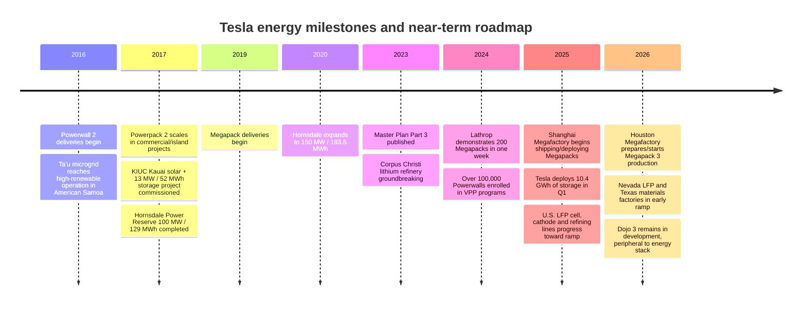
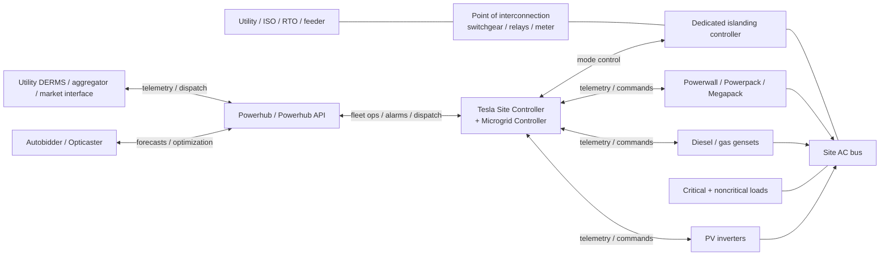

# Tesla Energy Deep Dive

## Executive summary

Tesla’s energy business has moved from a broad three-product lineup of **Powerwall, Powerpack, and Megapack** toward a more concentrated stack built around **Powerwall for residential and light commercial applications, Megapack for utility-scale storage, and software products such as Autobidder, Powerhub, and Microgrid Controller**. In Tesla’s own reporting, Powerpack has become a legacy offering as Megapack scaled after its 2019 introduction; by 2024–2026, Tesla’s public energy roadmap centered on Powerwall 3 expansion, Lathrop/Shanghai/Houston Megafactory capacity, U.S. localization of LFP cells and battery materials, and deeper software integration for VPP and market-participation use cases. citeturn33search16turn9search16turn30search1turn31search4turn32search24turn14view3

Three conclusions matter most for a microgrid or grid-integration lens. First, **Tesla’s strongest present-day advantage is system integration**: hardware, firmware, controls, market optimization, and remote monitoring are presented as a single stack, and Tesla now documents a control hierarchy that spans site-level real-time control, DER aggregation, and wholesale market dispatch. Second, **the technology center of gravity is shifting toward LFP-based stationary storage and domesticized supply chains**, because stationary storage values cost, cycle life, and thermal stability more than gravimetric energy density. Third, **the main near-term bottlenecks are not only manufacturing capacity but also interconnection rules, communications architecture, permitting/fire-code compliance, and market design for VPP aggregation**. citeturn14view3turn14view1turn16view0turn28search6turn28search3turn33search4turn38search2turn38search6turn40search0turn39search1turn39search5

For actual project design, the decisive issue is that Tesla publishes **strong product-level data on power, energy, certifications, and some interfaces**, but it does **not** publicly disclose several engineering details the user explicitly asked for at a product-by-product level, especially **exact cathode chemistry for every current stationary product, cycle-life curves, degradation guarantees, detailed BMS logic, and the full large-scale SCADA/protocol matrix for Megapack deployments**. A rigorous view, therefore, is to use Tesla’s public documentation for what is explicit, and to treat the missing items as diligence gaps that must be closed during procurement, interconnection, FAT/SAT planning, and EPC contracting. citeturn5view0turn7view0turn11view0turn14view0turn16view0

If no site size or jurisdiction is assumed, the most defensible baseline is this: **Powerwall 3 is optimized for North American split-phase homes and small sites; Megapack is Tesla’s utility-scale workhorse at 2-hour and 4-hour durations; Tesla software is credible for portfolio optimization and microgrid operation; and the largest execution risks lie in project integration rather than battery container procurement alone.** citeturn5view0turn11view0turn14view1turn14view0turn16view0

## Strategic trajectory and timeline

Tesla’s recent energy trajectory is best understood as a shift from “battery hardware vendor” to a **stacked platform** company. The hardware side is concentrating around **Powerwall 3** for residential backup/self-consumption/VPP participation and **Megapack** for front-of-the-meter and large C&I/utility deployments. The software side now has a clearer public architecture: **Autobidder** for wholesale-market revenue stacking, **Powerhub** for monitoring/control and fleet operations, **Microgrid Controller** for off-grid and partially off-grid control, and **Opticaster** for forecasting and economic dispatch. At the same time, manufacturing is being regionalized: **Lathrop** is the current high-volume Megapack anchor, **Shanghai** has begun deploying Megapacks, and **Houston** is being prepared for Megapack 3; alongside that, **Nevada LFP cell production** and **Texas cathode/lithium refining** are meant to reduce imported-cell and materials risk. citeturn30search1turn31search0turn31search4turn32search24turn32search13turn32search1turn14view3turn14view1turn14view0turn16view0turn14view2

The timeline shows two overlapping stories. The first is the **commercial maturation** of Tesla’s energy products: Ta’u and Kauai proved technically that Tesla storage could support weak-grid and renewable-shifting use cases; Hornsdale proved a battery could monetize multiple ancillary-services products while materially improving system stability. The second is the **industrialization/localization** story: Lathrop reached a 40 GWh annual run-rate benchmark in 2024, Shanghai started shipping/deploying Megapacks in 2025, and Tesla said in late 2025 that Megapack 3 production would begin in Houston in 2026 with up to 50 GWh per year of manufacturing capacity, while Nevada and Texas materials factories entered early ramp in 2026. citeturn30search7turn31search9turn31search0turn31search5turn31search4turn30search2turn30search14turn32search24turn32search13turn41search3turn42search2turn41search4turn41search8

One important analytical point is that **Dojo is not a core Tesla Energy product**. Tesla’s latest public update ties Dojo 3 to the goal of reducing **AI training cost over time**, not to a new energy-product capability. It may eventually help Tesla’s forecasting or optimization stack indirectly, but Tesla has not publicly linked Dojo to Autobidder, Powerhub, or Microgrid Controller performance in any specific, customer-facing way. For near-term energy planning, it should be treated as **strategically adjacent, not operationally decisive**. citeturn37search4turn14view3

## Product and battery technology profile

### Product comparison

| Product | Primary role | Key published specs | Controls / interfaces | Compliance / compatibility | Public lifecycle data | Sources |
|---|---|---|---|---|---|---|
| **Powerwall 2** | Residential / light commercial AC-coupled storage | 13.5 kWh usable, 14 kWh total; 5 kW continuous charge/discharge; 7 kW peak for 10s in backup; 90% round-trip efficiency; 120/240 V split-phase; 114 kg | Works with Backup Gateway; Tesla App; compatible with all major inverter brands for existing solar add-on use | UL 1642, UL 1741/SA/SB, UL 1973, UL 9540, IEEE 1547-2018, UN 38.3 | 10-year warranty; Tesla does **not** publish a public cycle-life curve in the datasource reviewed | citeturn7view0turn13search5 |
| **Powerwall 3** | Residential integrated solar + storage, higher-power whole-home backup, VPP | 13.5 kWh AC nominal battery energy; 5.8 / 7.6 / 10 / 11.5 kW rated continuous AC output depending configuration; up to 15.4 kW off-grid PV-only discharge at specific configuration; 5 kW max continuous charge, 8 kW with expansions; 89% solar-to-battery-to-home/grid efficiency; 97.5% solar-to-home/grid efficiency; up to 20 kW DC PV input; 6 MPPTs; 124 kg unit weight | Wi‑Fi, Ethernet, LTE/4G; RS‑485 for meters; dry-contact relay; works with Gateway 3, Backup Switch, Backup Gateway 2; Tesla App | UL 1741, UL 9540, UL 9540A, UL 3741, UL 1973, IEEE 1547/1547A/1547.1, CA Rule 21; North America split-phase only in reviewed datasheet | 10-year warranty; public cycle-life/degradation curves not disclosed in reviewed docs | citeturn5view0turn7view2turn13search5 |
| **Powerpack 2** | Legacy commercial / industrial / utility block storage; often paired with solar/microgrids | Tesla described Powerpack 2 as comprised of up to 210 kWh AC battery packs and up to 650 kVA inverters at 480 V; KIUC reference project used 13 MW / 52 MWh with 13 MW solar; SCE reference project used 20 MW / 80 MWh | Historical Tesla controller integration with SCADA; SCE case study explicitly cited Modbus/DNP3 between SCE SCADA and Powerpack controller | Public archived case studies, not a current flagship offering; Tesla said deployments fell after Megapack was introduced | Public standardized cycle-life/degradation data not found in reviewed Tesla materials; projects often used capacity maintenance agreements/performance guarantees | citeturn10search3turn42search2turn21search3turn9search16 |
| **Megapack** | Utility-scale / large C&I / renewable firming / ancillary services / capacity / microgrids | 2-hour version: 1,927 kW / 3,854 kWh, 92.0% round-trip efficiency; 4-hour version: 979 kW / 3,916 kWh, 93.7% round-trip efficiency; 480 V AC 3-phase interconnection; 84,000 lb max; integrated battery modules, inverters, thermal systems | Designed to pair with Autobidder, Powerhub, Microgrid Controller; utility-facing stack supports ancillary services, energy shifting, T&D support, inertia; exact external protocol matrix not fully public | IP66; UL 1973 / 9540 / 9540A / 1741; IEC 62619 | Tesla does not publish a standard public Megapack cycle-life or degradation curve; commercial contracts may include performance guarantees / augmentation terms project-by-project | citeturn11view0turn42search4turn14view1turn14view0turn16view0 |

### What the published data implies technically

A useful way to normalize Tesla’s products is to convert their published power and energy into **power-to-energy ratio** and **enclosure-level specific energy**. On that basis, **Powerwall 2** is a relatively conservative daily-cycling battery at roughly **0.37C** continuous power (5 kW / 13.5 kWh), while **Powerwall 3** is much more power-dense at roughly **0.85C** continuous power in its 11.5 kW configuration, and can exceed **1C** in specific off-grid PV-only settings. At the system level, Powerwall 2 works out to about **119 Wh/kg usable**, Powerwall 3 about **109 Wh/kg usable** using unit weight, and Megapack about **101–103 Wh/kg** at the container level, derived from Tesla’s published energy and weight figures. In other words, Tesla’s recent residential innovation is less about squeezing more kWh into a box and more about **delivering much more discharge power per installed battery**. citeturn7view0turn5view0turn11view0

On chemistry, the rigorous answer is mixed. Tesla’s reviewed public datasheets for **Powerwall 2, Powerwall 3, and Megapack** all stop at **“lithium-ion”** rather than naming a specific cathode chemistry. However, Tesla’s strategic manufacturing announcements make the direction clear for future stationary products: Tesla is ramping an **LFP cell factory in Nevada**, said in 2025 it was on course to begin **domestic LFP cell production for energy-storage products**, and a 2026 U.S.-confirmed LG Energy Solution agreement identifies **LFP prismatic cells for Megapack 3**. That, combined with broader market evidence that **LFP now powers over 90% of battery energy storage systems globally** and is **more than 40% cheaper than NMC on average**, strongly suggests Tesla’s stationary roadmap is converging around LFP where feasible, even though Tesla’s current public product pages remain sparse on chemistry disclosure. citeturn32search16turn30search3turn32search24turn23news29turn28search6turn28search0

That chemistry shift matters because the trade-offs line up well with stationary storage economics. IEA and recent peer-reviewed analyses show that **LFP packs are lower in energy density than NMC**, but **cheaper, more thermally stable, and more durable over prolonged cycling**. IEA’s 2025 outlook says LFP packs are about **one-fifth lower by mass and about one-third lower by volume** than NMC packs, but can also be charged to full state of charge with less long-run penalty than NMC; peer-reviewed comparison work likewise describes **higher energy density for NMC** and **better thermal stability and long-run consistency for LFP**. That makes LFP a more natural fit for Megapack-type products and other stationary storage applications where footprint matters, but safety, cycle life, and cost-per-delivered-kWh matter more. citeturn25search11turn24search12turn28search3

Thermal management and BMS data are another place where public disclosure is uneven. Tesla explicitly describes **Megapack as shipping with integrated thermal systems**, and Tesla’s emergency-response documents state that earlier Tesla Energy products such as **Powerpack and Powerwall** used **liquid cooling with a 50/50 ethylene-glycol/water mixture**, with typical coolant volumes of roughly **26 L in a Powerpack 2/2.5 unit** and **2.3 L in Powerwall 2**. Tesla also documents smart controls, metering, OTA updates, and site/fleet optimization software, but it does **not** publicly disclose the BMS algorithms, balancing strategy, SOC estimation method, life-modeling assumptions, or degradation reserve policy that would normally be needed for bankable lifecycle modeling. citeturn42search4turn9search0turn13search5turn10search3

## Software, interoperability, and microgrid integration

Tesla’s software stack is now substantial enough that it should be treated as a core part of the product, not an accessory. Tesla describes **Autonomous Control** as the common optimization layer behind **Autobidder, Opticaster, and Microgrid Controller**, and says a common software platform spans everything from **Megapack** to **virtual power plants made up of thousands of Powerwalls**, including support for some **non-Tesla assets** required for microgrids and utility-scale plants. The strongest takeaway is that Tesla’s energy moat is not merely hardware cost; it is **dispatch sophistication plus vertical integration**. citeturn14view3turn14view1turn14view2turn14view0

### Interoperability and control requirements

| Integration layer | Tesla’s public capability | Practical implication for microgrids / VPPs | Sources |
|---|---|---|---|
| **Residential battery-gateway edge** | Powerwall 3 supports Gateway 3, Backup Switch, Backup Gateway 2; Powerwall 3 exposes RS‑485 meter interface, dry-contact relay, Ethernet, Wi‑Fi, LTE/4G; Gateway 3 lists CAN communication | Residential integration is relatively well documented, but is strongly shaped by Tesla’s own gateway/islanding hardware. Existing site meters and inverter wiring must fit Tesla’s approved topology | citeturn5view0turn7view1turn7view2 |
| **Site microgrid control** | Microgrid Controller runs in the Tesla Site Controller and can control storage, solar, load, generators, and islanding; supports droop-based power sharing, generator start/stop, spinning reserve, curtailment, low-SOE load shedding, and quiet hours | Tesla has a real microgrid controller, not only a market optimizer. This is meaningful for off-grid and weak-grid sites, especially if diesel or reciprocating generation stays in the portfolio | citeturn16view0 |
| **Fleet operations / SCADA** | Powerhub provides SCADA-like monitoring and control, custom reports, remote commands, alerts, and fleet views; also manages non-Tesla assets such as generators, breakers, and transformers | Tesla can act as the operational HMI/SCADA layer for many sites, reducing middleware needs but increasing platform dependence | citeturn14view0turn42search3 |
| **External aggregation / DERMS** | Tesla documents a **Powerhub API** and says telemetry can be integrated into a **third-party DERMS** | Tesla is not fully closed. For VPP aggregation and utility coordination, API-level integration exists, though the full protocol surface is not publicly documented | citeturn14view0 |
| **Utility / market control interfaces** | A historical Tesla SCE Powerpack case study explicitly cited **Modbus/DNP3** between utility SCADA and the Powerpack controller | Historical evidence shows Tesla can support standard utility-control patterns; for current Megapack projects, the exact protocol matrix should be confirmed in procurement/interconnection documents | citeturn21search3 |
| **Standards / market access envelope** | IEEE 1547 governs DER interconnection/interoperability; FERC Order 2222 opens organized markets to DER aggregations; California Rule 21 remains a key smart-inverter/interconnection regime | Interoperability is not just a device issue. Market access depends on the jurisdiction’s interconnection, telemetry, and aggregation rules | citeturn38search0turn38search8turn38search2turn38search6turn38search1 |

The architecture above captures the control hierarchy Tesla now documents publicly. **Microgrid Controller** sits at the site edge to maintain stability and least-cost dispatch; **Powerhub** adds fleet operations, remote control, and third-party DERMS integration; **Autobidder** optimizes market participation and value stacking. For islanding, Tesla says the site controller communicates with a **dedicated Islanding Controller** to switch between on-grid and off-grid modes. For real microgrids, Tesla explicitly documents droop-based power sharing, spinning reserve management, renewable curtailment, and low-state-of-energy load shedding. citeturn16view0turn14view0turn14view1

On **black start**, Tesla’s public language is suggestive but not definitive. Tesla does not publish a broad black-start specification sheet for Megapack or Microgrid Controller in the reviewed materials. However, the documented ability to manage **paralleled grid-forming sources**, coordinate islanding, and operate off-grid microgrids means black-start-capable designs are clearly within scope **when the site is engineered for them**. For diligence purposes, though, black start should be treated as a **project-specific tested capability**, not something to assume from marketing alone; it belongs in FAT/SAT scripts, transition studies, and protection coordination reviews. citeturn16view0turn42search4

For VPPs, customer-side connectivity is not optional. Tesla’s Texas VPP and multiple utility programs require a **valid interconnection agreement**, an **active Tesla account/app**, and an **active internet connection** for the Powerwall. Tesla also notes that when connectivity is limited, local same-network monitoring can continue but some features may be unavailable. That is operationally important: the true availability of a distributed Tesla fleet depends not only on battery health, but also on **communications uptime, customer enrollment status, and utility program rules**. citeturn13search1turn20search3turn29search12

## Case studies and lessons learned

| Project | What happened | Why it matters | Main lesson | Sources |
|---|---|---|---|---|
| **Hornsdale Power Reserve, South Australia** | Initially completed at **100 MW / 129 MWh** in 2017; later implemented Tesla **Virtual Machine Mode** and was approved by AEMO to deliver inertia services at **150 MW / 193.5 MWh**; Tesla/partners report over **$150 million** of consumer benefit in the first two years | It is Tesla’s most important proof point that batteries can stack frequency response, arbitrage, reserve and system-strength value | The commercial value of Tesla storage is highest when markets reward **multiple fast grid services**, not only energy arbitrage | citeturn41search4turn41search8turn42search0turn41search0turn41search1 |
| **Kauai Island Utility Cooperative** | Tesla deployed a **13 MW / 52 MWh Powerpack** system paired with **13 MW solar** under a 20-year PPA; Tesla case study says it shifts solar into the **5 p.m.–10 p.m.** peak and saves about **1.6 million gallons of fossil fuel each year** | One of Tesla’s clearest island/weak-grid renewable-shifting references | On islanded or weak grids, storage value is not abstract: evening peak-shaving, ramp control, and fuel displacement can justify the system even before ancillary-service monetization | citeturn42search2turn42search0 |
| **South Australia Virtual Power Plant** | ARENA-backed phase 3A targeted **3,000 homes** within a broader up-to-**50,000 home / 500 MW** concept; Tesla originally developed the program, ownership transferred to **AGL in 2025**, while Tesla continues installation and maintenance roles on participating homes | A leading example of Powerwall VPP scaling beyond pilots | VPPs are as much a customer-acquisition, retailer, and utility-coordination challenge as a battery-control challenge; scale-up is organizationally slower than installing hardware | citeturn41search2turn41search14turn41search10turn41search6 |
| **Tesla Electric VPP, Texas / ERCOT ADER** | Tesla’s Texas VPP is enabled through the **ERCOT ADER pilot**; ERCOT describes ADER as aggregation of multiple DER premises responding to dispatch instructions; outside analysis reported early pilot participation below target, with only **25.5 MW** online as of Feb. 2025 versus an **80 MW** pilot goal | It shows that Texas is moving from emergency backup batteries toward wholesale-market DER aggregation | Market design and telemetry rules can slow VPP scale even when hardware is available; regulatory architecture is a first-order constraint | citeturn43search3turn43search4turn43search0turn43search9turn43search15 |
| **Puerto Rico Tesla VPP** | Tesla says Puerto Rico’s VPP lets Powerwall homes provide emergency support and pays **$1/kWh** for event exports; Tesla later said its VPP delivered **40–50 MW** during grid emergencies and peak-demand periods, while CESA reported the program helped address a **nearly 50 MW** shortfall in summer 2025 | A high-resilience, outage-prone grid is one of the strongest use cases for Powerwall aggregation | VPPs deliver the most visible value where outage risk is real, customer resilience matters, and conventional generation is fragile | citeturn43search2turn43search16turn43search7 |
| **Ta’u, American Samoa** | SolarCity/Tesla developed a solar-plus-storage microgrid that replaced the island’s near-total diesel dependence; reference materials describe a system designed to supply nearly all power needs from renewables | Tesla’s early island microgrid proof point | For remote systems, storage adoption is driven by fuel logistics, resilience, and diesel displacement—not only cost of energy | citeturn41search3turn41search11 |

Across those cases, five lessons repeat. **Value stacking** is crucial; **grid-forming and fast-frequency capabilities** become more important as synchronous generation retires; **communications and market rules** can become the real bottleneck in VPP programs; **customer reserve settings and trust** matter in residential fleets; and **institutional design**—utility agreements, retailer relationships, interconnection pathways, and performance guarantees—is often more determinative of project success than cell chemistry alone. citeturn14view1turn16view0turn43search4turn20search1turn20search4turn42search2turn41search6

## Manufacturing, supply chain, economics, and risk

### Manufacturing scale and supply chain

Tesla’s energy-manufacturing story is now clearly multi-site and increasingly regional. **Lathrop Megafactory** is publicized at **10,000 Megapacks per year / 40 GWh**. Tesla reported that Lathrop demonstrated **200 Megapacks in a single week** in 2024. **Shanghai Megafactory** was described as on track to begin shipping in Q1 2025 and later as already deploying Megapacks. **Houston** is Tesla’s next major energy plant: Tesla said in late 2025 that **Megapack 3 production** would begin there in 2026 with **up to 50 GWh/year** of capacity, with Q1 2026 updates saying lines were being prepared for Megapack 3 start of production. citeturn30search1turn30search7turn31search9turn31search0turn31search4turn30search2turn30search14

The supply chain is being pushed upstream as well. Tesla’s **Corpus Christi lithium refinery** broke ground in 2023, and Tesla later said it had **commenced pilot production**, describing it as the first spodumene-to-lithium-hydroxide refinery in North America. Tesla’s 2025 and 2026 updates also said its **cathode production plant** and **LFP cell lines in Nevada** were moving into production or early ramp. This is strategically important because the stationary market now overwhelmingly favors **LFP**, and IEA says more than **90% of battery energy storage systems globally** use LFP; the same IEA work emphasizes that LFP supply chains remain geographically concentrated. Tesla’s in-house materials and cell projects are therefore best seen as geopolitical and tariff-risk mitigation, not only margin expansion. citeturn32search1turn32search13turn30search3turn32search24turn32search16turn28search6turn25search5

The near-term constraint is that Tesla itself has said **both Powerwall and Megapack remained supply constrained** as of the Q4 2024 update, even while costs were falling. Tesla also warned in 2025 that **tariffs** could affect supply and demand, although it still expected capacity expansion to drive long-term deployment growth. That is the right way to think about Tesla energy in 2026: demand is strong, manufacturing is scaling, but cells, materials, tariff exposure, interconnection timetables, and commissioning complexity remain real constraints. citeturn33search4turn33search8

On external cell partners, the clearest current public evidence points to **future U.S.-made LFP supply for Megapack 3 from LG Energy Solution beginning in 2027**, confirmed by U.S. government statements and Reuters reporting. Historically, Tesla’s battery ecosystem has also included Panasonic and CATL, but for the stationary roadmap the highest-confidence public link is now the **LGES-Megapack 3** pipeline plus Tesla’s own Nevada LFP buildout. citeturn23news29turn34news23turn36search1turn32search16

Tesla’s recycling posture is stronger than its public lifecycle transparency. Tesla says **none of its scrapped lithium-ion batteries go to landfill and 100% are recycled**, and its 2024 Impact material highlights battery-recycling milestones. That is positive from a circularity standpoint, but it does not substitute for project-level disclosure on augmentation schedules, residual-value assumptions, or chemistry-specific recovery economics. citeturn32search15turn32search0

### Cost trends and LCOES

Because the user did not specify a project size, duty cycle, tariff, market region, tax treatment, or resilience-hour target, Tesla-specific LCOES cannot be stated precisely from public sources. The best rigorous approach is to use **market reference ranges** and then explain how Tesla fits inside them.

At the market level, the trend is favorable. IEA reports that in 2025 **LFP battery packs were more than 40% cheaper on average than NMC alternatives**, and that LFP now dominates stationary storage. BloombergNEF reported average **stationary-storage battery pack prices of $70/kWh in 2025**, the cheapest major pack segment, while overall average battery-pack prices fell to **$108/kWh**. Tesla’s own financial disclosures are directionally consistent with that market trend: in Q2 2025 Tesla reported lower average cost per unit for **Megapack and Powerwall** due primarily to lower raw-material costs, while energy gross margin rose from **24.6% to 30.3%** year over year. citeturn28search0turn28search6turn28search1turn28search4turn33search12

For levelized storage cost, Lazard’s 2025 LCOS update is a useful benchmark. It showed **utility-scale standalone 4-hour BESS** at roughly **$115–$254/MWh LCOS** in 2025, down from **$170–$296/MWh** in 2024, with a similar decline in 2-hour systems. Those ranges are not Tesla-specific, but they are the right order of magnitude for the environments in which Tesla’s Megapack competes. In practice, a Tesla project will move toward the low end of the range when it has **cheap land, fast interconnection, strong EPC execution, favorable tax treatment, and multiple monetizable services**; it will drift upward when it carries **augmentation reserves, expensive grid studies, constrained sites, or weak revenue stacking**. citeturn27view0turn26search8

For residential economics, pure LCOS is often the wrong lens. Powerwall value depends on **retail tariff arbitrage, outage resilience, backup sizing, solar self-consumption, and VPP payments**, and those vary more by jurisdiction than by hardware alone. Tesla’s own VPP programs illustrate this dispersion: California ELRP programs pay **$2/kWh incremental event export**, Puerto Rico pays **$1/kWh**, Texas uses Tesla Electric bill credits, and Tucson Electric’s program is structured partly in **$/kW average performance**. That means Powerwall returns cannot be generalized cleanly without a utility and tariff context. citeturn20search1turn20search7turn20search4turn20search8turn20search3

### Regulatory, safety, and permitting considerations

Any Tesla microgrid or grid-connected energy-storage deployment still lives inside the conventional standards and permitting stack. At the interconnection layer, **IEEE 1547-2018** remains the foundational DER interconnection and interoperability standard. In organized wholesale markets, **FERC Order 2222** is the main U.S. framework that enables aggregated DER participation. In California, **Rule 21** remains a central smart-inverter/interconnection regime for distributed systems, and Tesla’s residential documentation explicitly lists **IEEE 1547** and **CA Rule 21** compliance for Powerwall 3. citeturn38search0turn38search8turn38search2turn38search6turn38search1turn5view0

At the safety and fire-code layer, the central standards are **UL 9540** for system safety listing, **UL 9540A** for thermal-runaway fire-propagation testing, and **NFPA 855** for installation requirements for stationary energy storage systems. Tesla publicly lists **UL 9540/9540A** on Powerwall 3 and Megapack, and UL describes UL 9540A as designed for building-code and fire-safety use in battery energy storage systems. NFPA describes NFPA 855 as setting minimum requirements to mitigate ESS hazards, while UL’s code guidance emphasizes that newer NFPA 855 provisions rely heavily on **large-scale fire testing, vent-gas ignition analysis, suppression, and hazard-mitigation evidence**. For real projects, that means AHJs increasingly want **product test reports, hazard-mitigation analysis, siting/spacing layouts, ventilation strategy, gas detection, emergency response plans, and utility coordination** before issuing permits. citeturn5view0turn11view0turn39search1turn39search5turn40search0turn40search2

Recent events also show why supplier quality remains material. In late 2025, the U.S. CPSC announced a recall of about **10,500 Powerwall 2 AC battery systems** over overheating, fire, and burn hazards tied to a cell defect. Tesla’s mitigation included remote discharge/charge limiting and replacement. The recall does not invalidate Tesla’s energy business, but it is a strong reminder that **cell-vendor quality control, pack-level fault isolation, remote monitoring, and emergency response procedures** remain non-trivial project risks even for leading vendors. citeturn29search1turn29news21

### Risk and mitigation summary

| Risk | Why it matters for Tesla projects | Best mitigation | Sources |
|---|---|---|---|
| **Cell supply and tariff exposure** | Stationary storage is now heavily LFP-based, and LFP supply chains remain concentrated; Tesla itself warned of tariff-related volatility and supply constraints | Prefer domestic-content pathways where available; lock augmentation and supply options early; diversify timing across Lathrop/Shanghai/Houston where procurement permits | citeturn28search6turn33search4turn33search8turn23news29turn32search24 |
| **Interconnection and standards mismatch** | Storage deployment speed can be slowed by IEEE 1547 implementation, Rule 21 process rules, and market aggregation requirements | Start utility studies and telemetry design early; align gateway/controller architecture to jurisdictional rules | citeturn38search0turn38search1turn38search2turn43search3 |
| **Permitting / fire-code delays** | UL 9540A and NFPA 855 evidence are increasingly central to AHJ approval | Obtain full test reports, spacing assumptions, HMA/fire package, and emergency-response plans before final site design | citeturn39search1turn39search5turn40search0 |
| **Software / communications dependence** | VPP and fleet dispatch require connectivity, valid enrollment, and utility-compatible telemetry | Design for comms redundancy, local fallback modes, and offline-safe operating envelopes | citeturn20search3turn29search12turn14view0 |
| **Lifecycle / degradation uncertainty** | Tesla does not publish full public life curves for current stationary products reviewed here | Require contractual augmentation, capacity-maintenance terms, and performance guarantees in the commercial package | citeturn42search2turn11view0turn5view0 |
| **Supplier quality / safety events** | The 2025 Powerwall recall shows vendor and cell-level issues can propagate into field risk | Demand traceability, serial-level monitoring, recall response clauses, and emergency operating procedures | citeturn29search1turn29news21 |
| **VPP market-design risk** | Texas ADER and other programs show that regulation can slow monetization even when the hardware is ready | Underwrite VPP revenue conservatively; keep storage bankable on backup, self-consumption, or RA/ancillary value alone | citeturn43search9turn43search15turn14view1 |

## Open questions and limitations

Several items the user requested are **not fully answerable from Tesla’s public materials alone**. In the product docs reviewed here, Tesla does not publicly publish **exact cathode chemistry for every current stationary product**, **cycle-life curves**, **degradation trajectories**, **end-of-warranty remaining-capacity bands for Megapack**, **detailed BMS logic**, or a complete **large-scale external protocol/SCADA mapping** for current Megapack projects. Tesla does publish strong data on power, energy, interconnection voltage, certifications, some interfaces, and software functionality, but not enough to replace vendor diligence or EPC engineering. citeturn5view0turn7view0turn11view0turn14view0turn16view0

Because the request did not specify a location or microgrid size, the regulatory and architectural analysis above is necessarily **U.S.-leaning**, since Tesla’s most detailed public support documentation and market-program pages are North America-focused. A real design would still need a site-specific matrix covering **voltage level, fault duty, utility tariff, ISO/RTO access, protection coordination, resilience hours, critical-load segmentation, fire setback rules, and telecom redundancy** before a product choice between Powerwall-class and Megapack-class architecture could be made rigorously. citeturn5view0turn7view1turn7view2turn11view0turn38search0turn40search0

Taken together, the high-confidence conclusion is that Tesla is strongest today where the problem is **integrated storage + controls + market participation**, not merely battery boxes. Its energy roadmap is credible and gaining scale, especially around Megapack and VPP software. But for financiers, utilities, and microgrid developers, the most important discipline is to treat Tesla’s public stack as a **strong starting point**, then force closure on the non-public engineering and commercial details that actually determine bankability. citeturn14view3turn14view1turn14view0turn16view0turn30search1turn31search4turn32search24